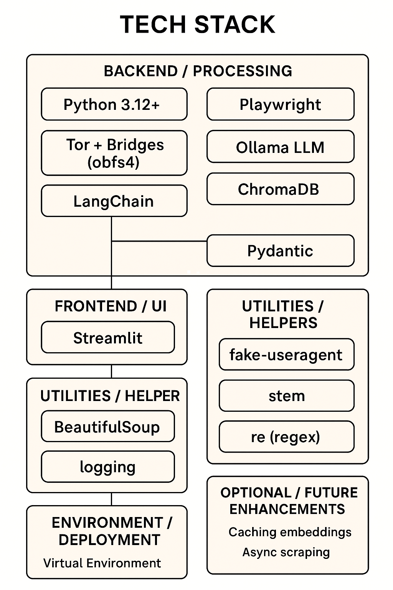
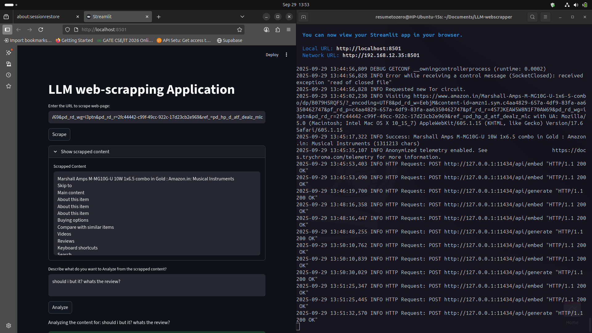
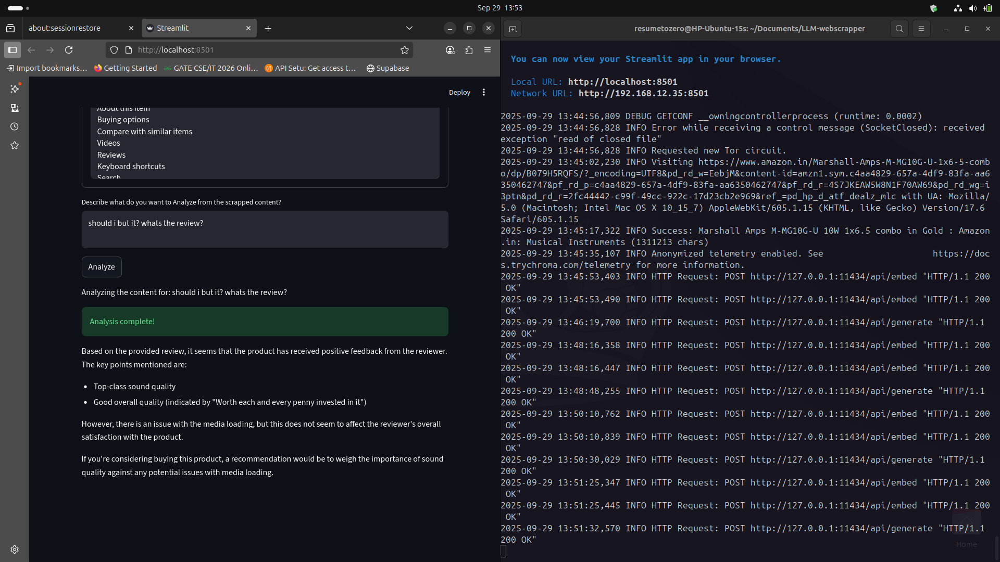

# LLM‑Analyser‑Webscrapping

> Streamlit + Playwright pipeline that scrapes dynamic web pages, extracts and preprocesses text (BeautifulSoup), and analyzes content using an LLM — a local model runner (Ollama). Optional Tor + bridge (obfs4) support is included so the scraper can work from censored networks. This README **does not** contain any secrets or private bridge credentials — it explains how to generate and configure them locally.

---

## Table of Contents

* [Project Description](#project-description)
* [Features](#features)
* [Tech Stack](#tech-stack)
* [Prerequisites](#prerequisites)
* [Quick Start](#quick-start)
* [Detailed Setup](#detailed-setup)

  * [Clone repo](#clone-repo)
  * [Create & activate Python venv](#create--activate-python-venv)
  * [Install Python dependencies](#install-python-dependencies)
  * [Install Playwright browsers](#install-playwright-browsers)
  * [Tor setup (with optional bridges / obfs4)](#tor-setup-with-optional-bridges--obfs4)
  * [Install Ollama (optional)](#install-ollama-optional)
* [Usage](#usage)

  * [Run the Streamlit app](#run-the-streamlit-app)
  * [Example: headless Playwright + Tor snippet](#example-headless-playwright--tor-snippet)
* [Handling CAPTCHAs & Ethics](#handling-captchas--ethics)
* [Saving, session state & outputs](#saving-session-state--outputs)
* [Troubleshooting](#troubleshooting)

---

## Project Description

This project provides an end‑to‑end flow to:

1. Render web pages (including JS‑heavy sites) with **Playwright**.
2. Extract and clean text with **BeautifulSoup**.
3. Optionally route traffic via **Tor** (and bridges/obfs4 where Tor is blocked) to rotate IPs.
4. Analyze or summarize text using a local runner such as **Ollama**.

It’s aimed at researchers, final‑year projects, and prototyping LLM-based content analysis on scraped web pages.

---

## Features

* Render dynamic pages (Playwright) and parse HTML (BeautifulSoup).
* Tor SOCKS5 proxy support and optional obfuscation (bridges / obfs4) for censored networks.
* Human-like browsing (UA rotation, scrolling, randomized delays) to reduce detection.
* Save raw HTML and cleaned text in Streamlit session state and to disk.
* Store chunks in Chroma vector DB with embeddings for fast retrieval.
* Query the content using Ollama LLM for analysis.
* Display scraped content and analysis results in **Streamlit** interface.
* Optional local LLM inference via Ollama (small models recommended for low‑RAM machines).

---

## Tech Stack

* Python 3.10+
* Streamlit (UI)
* Playwright (browser automation)
* BeautifulSoup (`bs4`) (parsing)
* `requests` / `httpx` (HTTP)
* Tor (`tor`) + `obfs4proxy` (bridges)
* `stem` (control Tor from Python)
* Ollama (optional local LLM runner)
* `fake-useragent` (UA rotation)
* ChromaDB (local vector database)
* Pydantic (data validation)



---
## Product Image




---

## Prerequisites

* Git, curl or wget, Python 3.10+
* For Tor + bridges: root/sudo access to install system packages
* If using Ollama locally: enough disk and RAM for chosen models (see notes below)

---

## Quick Start

```bash
# clone
git clone https://github.com/resumetozero/LLM-Analyser-Webscrapping.git
cd LLM-Analyser-Webscrapping

# venv
python3 -m venv venv
source venv/bin/activate

# deps
pip install --upgrade pip
pip install -r requirements.txt

# playwright browsers
playwright install

# run
streamlit run main.py
```

Open `http://localhost:8501` in a browser.

---

## Detailed Setup

### Clone repo

```bash
git clone https://github.com/resumetozero/LLM-Analyser-Webscrapping.git
cd LLM-Analyser-Webscrapping
```

### Create & activate Python venv (recommended)

```bash
python3 -m venv venv
source venv/bin/activate        # Linux/macOS
# venv\Scripts\activate         # Windows (PowerShell)
```

### Install Python dependencies

```bash
pip install --upgrade pip
pip install -r requirements.txt
```

If you don't have `requirements.txt` or want the common packages:

```bash
pip install streamlit playwright beautifulsoup4 requests stem fake-useragent python-dotenv
```

### Install Playwright browsers

```bash
playwright install
```

---

### Tor setup (with optional Bridges / obfs4)

**Important:** do **not** commit passwords or bridge credentials to your repo. Use the steps below to **generate** your own hashed password and add bridge lines locally.

1. **Install Tor and obfs4proxy**

```bash
sudo apt update
sudo apt install tor obfs4proxy
```

2. **Generate a hashed control password** (do this locally; use a strong passphrase)

```bash
# replace with your chosen passphrase
tor --hash-password "YOUR_PLAIN_PASSWORD"
# copy the output (starts with 16:)
```

3. **Edit `/etc/tor/torrc`** with `sudo` and append the relevant configuration lines. **Use placeholders** and **replace** with your own hashed password and bridge lines:

```text
# /etc/tor/torrc  (append these lines; DO NOT commit this file)
ControlPort 9051
SocketPort 9050
HashedControlPassword 16:YOUR_HASHED_PASSWORD_HERE
CookieAuthentication 0
UseBridges 1
ClientTransportPlugin obfs4 exec /usr/bin/obfs4proxy

# Add your obfs4 Bridge lines here (example format; replace with real bridges)
# Bridge obfs4 <IP>:<PORT> <FINGERPRINT> cert=<CERT> iat-mode=0
# Bridge obfs4 <IP>:<PORT> <FINGERPRINT> cert=<CERT> iat-mode=0
```

4. **Where to obtain bridges safely**

* If your network blocks Tor, request bridges via the official Tor Project channels:

  * Visit: [https://bridges.torproject.org/](https://bridges.torproject.org/) (may require email)
  * Or use the Tor Browser's built‑in bridge request flow.
* **Do not** paste private bridge credentials into public repos or share them.

5. **Restart Tor**

```bash
sudo systemctl restart tor
sudo systemctl status tor --no-pager
```

6. **Test control port (Python example)** — this uses your **plain** password (not the hashed one):

```python
from stem.control import Controller
from stem import Signal
with Controller.from_port(port=9051) as controller:
    controller.authenticate(password="YOUR_PLAIN_PASSWORD")
    controller.signal(Signal.NEWNYM)
```

7. **Use Tor as SOCKS proxy in Playwright**:

```python
proxy = {"server": "socks5://127.0.0.1:9050"}
browser = p.chromium.launch(headless=True, proxy=proxy)
```

---

### Install Ollama (optional — local LLM runner)

**Native install (recommended for low-RAM laptops):**

```bash
# official installer
curl -fsSL https://ollama.com/install.sh | sh
# or download release and install manually if curl fails
```

**Docker option (isolated, but higher memory use):**

```bash
docker run -d -p 11434:11434 --name ollama ollama/ollama
```

**Pull and run a small model (recommended for ~8GB RAM):**

```bash
# choose a small model; example names may vary
ollama pull llama3.2
ollama pull nomic-embed-text
ollama run llama3.2
```

**Python client usage (after Ollama running):**

```bash
pip install ollama
```

```python
from ollama import chat
resp = chat(model='gemma3-small', messages=[{'role':'user','content':'Summarize this page.'}])
print(resp.message.content)
```

**Model selection tip:** on an 8GB machine prefer 1–3B parameter models. Larger models require much more RAM and/or GPU.

---

## Usage

### Run the Streamlit app

```bash
source venv/bin/activate
streamlit run main.py
```

* Enter a URL in the UI and click **Scrape**.
* The app will fetch the page (via Playwright; optionally via Tor), show raw HTML, preprocess text, and let you send queries to the LLM.

### Example: headless Playwright + Tor snippet

```python
from playwright.sync_api import sync_playwright

proxy = {"server": "socks5://127.0.0.1:9050"}  # Tor local socks
with sync_playwright() as p:
    browser = p.chromium.launch(headless=True, proxy=proxy)
    page = browser.new_page()
    page.goto("https://finance.yahoo.com/", timeout=120000)
    html = page.content()
    browser.close()
```

---

## Handling CAPTCHAs & Ethics

* **Detect captchas** (look for known strings/HTML) and **pause** for manual resolution. Do **not** attempt unauthorized CAPTCHA solving.
* **Respect `robots.txt`** and site ToS. Prefer official APIs when available (e.g., Yahoo Finance JSON endpoints).
* **Rate limit** your requests (e.g., 1–3 requests/min per IP) and randomize behavior to reduce detection.
* Document ethics and legal considerations in your project report.

---

## Saving, session state & outputs

* The app stores:

  * `st.session_state['dom']` — raw HTML.
  * `st.session_state['text']` — cleaned text.
* It can write `output.txt` (cleaned text) and can be extended to persist to CSV, SQLite, or Postgres.

---

## Troubleshooting

* **Playwright import error in VS Code**: ensure VS Code uses the venv interpreter and `playwright install` completed.
* **`SocketClosed` / Stem warnings**: verify `/etc/tor/torrc`, ensure control port and hashed password are configured, restart Tor, and reduce NEWNYM frequency.
* **Ollama installer failed (incomplete download)**: download release from GitHub and install manually or use Docker fallback.
* **If Tor exit nodes are blocked**: add verified obfs4 bridges and test connectivity with Tor Browser first.

